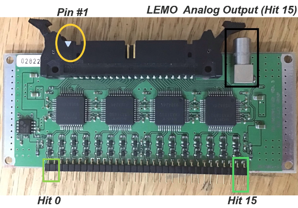
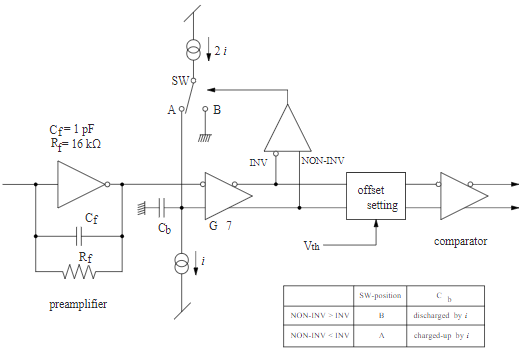
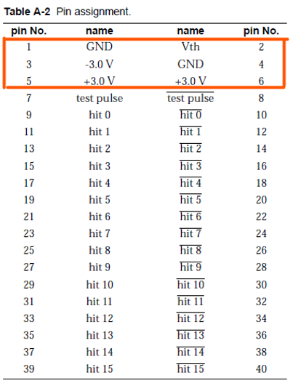
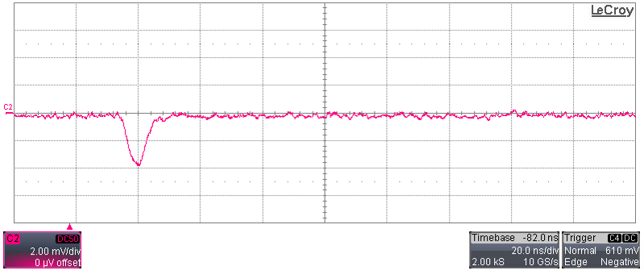
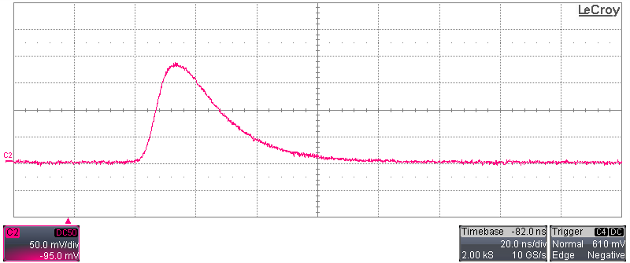
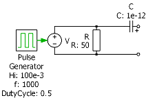

# Muon Detector Data Acquisition System

FPGA based DAQ for sTGC muon detector system, for muongraphy purposes.

Index:

1. [Tools and Environment](#Tools-and-Environment)
2. [Vivado Project Rebuild](#Vivado-Project-Rebuild)
3. [Author](#Author)
4. [Supervising Professor](#Supervising-Professor)
5. [Apendix A: Version control of an HDL Vivado Project](#Appendix-A-Version-control-of-an-HDL-Vivado-Project)
6. [Appendix B: Interfacing LVDS Signals to an Artix 7 FPGA](#Appendix-B-Interfacing-LVDS-Signals-to-an-Artix-7-FPGA)
7. [Appendix C: ASD Board Use and Configuration](#Appendix-C-ASD-Board-Use-and-Configuration)

## Tools and Environment

Project designed on Vivado 2019.1 under Windows 10.

The FPGA used for this design is a TRENZ TE0712-02 mounted on a TE0703-06 carrier board.

## Vivado Project Rebuild

To rebuild this project, open Vivado TCL console, and type the following lines:

```bash
cd "path_to_main_folder_of_this_repo/"
source build.tcl
```

Where 'path_to_main_folder_of_this_repo' refers to the corresponding folder path of the project, where 'build.tcl' file is. This file use or creates a folder named 'wd' (working directory) to save all generated Vivado outputs. Ensure to don't commit this folder or the files it contains.

## Author

- **Jairo González** -  jairo.gonzalez.13 [at] sansano.usm.cl

## Supervising Professor

- **Gonzalo Carvajal** - Departamento de Electrónica - Universidad Técnica Federico Santa María

----

## Appendix A: Version control of an HDL Vivado Project

A version control system, like *git*, enables the developer to maintain multiple branches, synchronize their work with others, revert changes and keep tidy versions of a project.

Using tools like these with Vivado Projects turns out to be pretty useful. In this appendix, I have summarized all tips and stages to control versions of a Vivado Project as a step-by-step tutorial. The main idea is to work just with the core files of the development, keeping outside any other file like synthesis outputs, .bit files, and others.

The tutorial makes use of "git" and a remote repository hosted on *github.com*.

Requisites:

- A github.com account.
- git installed in your machine, enabled to be operated through a terminal.
- Vivado HDL SDK (Version 2019.1 it's used in this tutorial).

### How

- **Create repo**

  Log in to a GitHub account and click the *"New"* green button to create a new repository.

  

  Choose your repository name and configure the essentials. I recommend creating a blank project, without *readme* o *.gitignore* files. Upload them remotely on a first commit.

- **Clone repo**

  From the repository dashboard, look for the green button *"Code"* and copy the URL available for HTTPS cloning.

  

  If you haven't installed *git* yet, go to your local machine and install it via command line o via a downloadable executable file.

  Go to the folder where you want to save your repository and open a command prompt. Type the following on it, where *your-git-url* is the URL you have previously copied:

  ```bash
  git clone your-git-url
  ```

- **Create initial files and folders**

  Go to the repository folder and create the following folders: *ip*, *src*, *wd*, and *xdc*.

  - *ip*: This folder is to include IP cores files.

  - *src*: This folder is for saving the source files of your project

  - *sim*: This folder is for saving the simulation files for testing your design

  - *xdc*: This one is to save .xdc constraints files

  - *wd*: Finally, this folder is to save synthesis, implementation outputs, and any other Vivado generated files. Don't include this folder in commits.

  Create a README.md and a .gitinit file. The readme file is relevant for explaining your repo content.  You should write it in Markdown language.

For the .gitinit, include any system-created file to don't upload it to git, and add the following lines to don't upload files and folders generated from Vivado:

  ```txt
  wd/
  .Xil/
  ```

- **Prepare project**

  Create your project, as usual, saving it into de "wd". If you have already created it on another folder, move it to "wd".
  
  Copy or create your src files on the "src" folder on the repo.  Do the same with simulation files, constraints files to their respective folders on the repo.

  If you use IP cores, ensure that you have enabled the option of IP Core containers. It creates an IP Core out of a single *.xcix* file, which is useful to version control purposes. If Vivado asks you to convert your IP cores to containers, click on *Ok*. Then move your single IP Cores files to the respective "IP" folder in the repo.

  

  Finally, replace the files listed on the "Source" section of Vivado with the files saved on your repository.

- **Export Tcl**

  Export a Tcl file of the project from the Vivado GUI menu. Save it on your main repo directory and name it *build.tcl*. Keep in mind that you may need to do this every time you add or remove a file on the Vivado project. It is ok to don't do it, but you will need to import and delete files manually when rebuilt.

  

- **Edit Tcl**

  Edit your Tcl file to rebuild the project just inside "wd" folder. To do this, search the following three commands:

  ```Tcl
  # Set the reference directory for source file relative paths (by default the value is script directory path)
  set origin_dir "."
  ```
  
  ```Tcl
  # Set the directory path for the original project from where this script was exported
  set orig_proj_dir "path-to-the-actual-vivado-project"

  # Create project
  create_project ${_xil_proj_name_} ./${_xil_proj_name_} -part part-of-your-fpga
  ```

  And replace them with the following lines respectively:

  ```Tcl
  # Set the reference directory for source file relative paths (by default the value is script directory path)
  set origin_dir [file dirname [info script]]
  ```

  ```Tcl
  # Set the directory path for the original project from where this script was exported
  set orig_proj_dir "[file normalize "$origin_dir/wd/"]"

  # Create project
  create_project ${_xil_proj_name_} $orig_proj_dir/${_xil_proj_name_} -part part-of-your-fpga
  ```

- **Commit and push**

  At this point, everything is ready to do the first commit and start controlling your project versions.
  Commit your work and push it with the following commands. Ensure you have correctly configured your ".gitignore" file before committing! Review your folders and lookup for any hidden file to ignore them explicitly.

  When done, commit:

  ```bash
  git add .
  git commit -m "First commit."
  git push
  ```

   And that's all!

- **Delete older Vivado project folder**
  
  Now you can freely delete your older Vivado project folder because you can rebuild it again running your new *build.tcl* script as indicated in [Vivado Project Rebuild](##Vivado-Project-Rebuild) section.

### Appendix A References

1. [J. Johnson, "Version Control for Vivado Projects", www.fpgadeveloper.com, 2014](http://www.fpgadeveloper.com/2014/08/version-control-for-vivado-projects.html)

2. [Xilinx,"Vivado Revision Control Tutorial - UG1198 (v2015.4)", 2015](https://www.xilinx.com/support/documentation/sw_manuals/xilinx2015_4/ug1198-vivado-revision-control-tutorial.pdf)

3. [Xilinx, "Using Source Control Systems With The Vivado Tool - UG892 (v2018.2)", Chapter 5, 2018](https://www.xilinx.com/support/documentation/sw_manuals/xilinx2018_2/ug892-vivado-design-flows-overview.pdf#nameddest=xUsingSourceControlSystemsWithTheVivadoTool)

----

## Appendix B: Interfacing LVDS Signals to an Artix 7 FPGA

This project base its functionality on a physical data link between an FPGA and an ASD Board (Amplificator, shaper, and discriminator board). The last one produces digital pulses through LVDS drivers, while the FPGA receives them with an internal LVDS receiver.

This appendix explains how to interface those devices in any project, understanding the relevant protocols and requirements to do so.

### About LVDS

LVDS (Low Voltage Differential Signaling) is a physical layer standard, useful in applications that need high signal integrity, low noise, or when the driver and receptor are far away from each other.

Main characteristics:

- Low voltage drivers (2V-5V)
- High-speed data transfer (up to 500Mbps in a single differential pair)
- Preserves signal integrity
- High noise immunity, minimizes EMI, low jitter, and skew.
- Low-cost, low power, small footprint, simple implementation

It essentially transfers data in a 2-wires line, where the signals have opposite voltage amplitude. These signals are on a driver offset voltage. It has around 400mV voltage difference between pairs, mounted on a voltage offset around 1.2V typically.

The following image illustrates the LVDS signals, first as single-ended signals and finally as the differential signal itself. *Vidth* stands for *Input differential threshold voltage*, knows as the voltage level after the receiver captures the differential signal. *Vob* is the positive wire, *Voa* the negative one, and *Vod* the resulting differential signal.

 for Scalable Coherent Interface (SCI) Microprocessor and Microcomputer Standards Committee of the IEEE Computer Society. Technical report,1996.")

The differential system emits and receives only the difference between the two wires and eliminates the common-mode voltage (ground voltage difference between driver and receptor, driver voltage offset, and noise).

The implementation of an LVDS data line requires a driver, a transmission line, a 100 Ohm resistor, and a receiver.

, 2018.")

The transmission line must have a 100 Ohm differential impedance (50 Ohm line to ground each) and must be symmetrical to get a balanced transmission line and preserve signal integrity. It ensures the line impedance adaptation to match with the terminal 100 Ohm resistor used at the receiver end. Usually, this line is a twisted pair to enhance common-mode noise rejection.

### Artix 7

Xilinx 7 series FPGAs are capable of driving and receiving LVDS signals on its differential I/O pairs, with the option of enabling a 100 Ohm internal resistor.

The 7 series FPGAs have LVDS and LVDS_25 voltage standard ports, where the only difference is the voltage supply needed for each standard. LVDS_25 requires to power up the LVDS pair bank with a 2.5V voltage supply, while the other requires a supply voltage of 1.8V. LVDS_25 is available in HR banks (High Rank), and LVDS is available on HP banks (High Performance). Using any of these standards with their correct supply voltage makes it possible to use the internal 100 Ohm resistor. It's possible to supply a different voltage, like 3.3V, but it will require disabling the internal resistor and attaching an external 100 Ohm resistor to the circuit.

In particular, Artix 7 has only HR banks, so it has only the LVDS_25 voltage standard available. The Trenz board used in this project has only 1.8V, 3.3V, and 5V supply voltages, thus to use the internal resistor its needs an external 2.5V voltage supply.

### Design

To properly use an LVDS port in a Xilinx 7 series FPGA, declare the differential pair and the voltage standard on the constraints file. For example, to use LVDS_25 with the differential pair B16_L22_P (positive) and B16_L22_N (negative) respectively in the E22 and D22 FPGA ports, use the following lines:

```TCL
set_property -dict {PACKAGE_PIN E22 IOSTANDARD LVDS_25} [get_ports B16_L22_P];
set_property -dict {PACKAGE_PIN D22 IOSTANDARD LVDS_25} [get_ports B16_L22_N];
```

Finally, to properly use the differential pair, you need to use an IO Buffer. These buffers turn an input differential signal into a single-ended signal or vice versa.

For example, to use the differential pair as an input with LVDS_25 standard and the internal 100 Ohm resistor enabled, use an IBUFDS (Input Buffer for Differential Singal) as follows:

```Verilog
// IBUFDS: Differential Input Buffer - Verilog
// 7 Series
// Xilinx HDL Libraries Guide, version 13.4
IBUFDS #(
    .DIFF_TERM("TRUE"), // Differential Termination (TRUE or FALSE)
    .IBUF_LOW_PWR("FALSE"), // Low power="TRUE", Highest performance="FALSE"
    .IOSTANDARD("LVDS_25") // Specify the input I/O standard (LVDS or LVDS_25)
    ) IBUFDS_LVDS_25 (
    .O(lvds_output), // Buffer output
    .I(B16_L22_P), // Diff_p buffer input (connect directly to top-level port)
    .IB(B16_L22_N) // Diff_n buffer input (connect directly to top-level port)
);
// End of IBUFDS_inst instantiation
```

The LVDS receiver is configured correctly at this point. To use it, connect the respective differential driver with a symmetrical twisted-pair wire of 50 Ohm impedance (100 Ohm differential impedance). And that's all!

### Appendix B References

1. [Video: Texas Instruments - LVDS Overview](https://www.youtube.com/watch?v=U6eGpJBWtbU)

2. [Xilinx, Xilinx 7 Series FPGA Libraries: Guide for HDL Designs (UG768), 2015.](https://www.xilinx.com/support/documentation/sw_manuals/xilinx13_4/7series_scm.pdf)

3. [IEEE Standard for Low-Voltage Differential Signals (LVDS) for Scalable Coherent Interface (SCI) Microprocessor and Microcomputer Standards Committee of the IEEE Computer Society. Technical report,1996.](https://standards.ieee.org/standard/1596_3-1996.html)

4. [ATLAS Thin Gap Chamber Production Readiness Review Report Amplifier-Shaper-Discriminator ICs. Technical report, 1999.](https://atlas.kek.jp/tgcelec/ASD/ASD-PRR.pdf)

5. [Xilinx and Inc. Artix-7 FPGAs Data Sheet: DC and AC Switching Characteristics (DS181). Technical report, 2018.](https://www.xilinx.com/support/documentation/data_sheets/ds181_Artix_7_Data_Sheet.pdf)

6. [7 Series FPGAs SelectIO Resources User Guide (UG471), 2018.](https://www.xilinx.com/support/documentation/user_guides/ug471_7Series_SelectIO.pdf)

7. [Xilinx Support - AR#43989- 7 Series FPGAs, LVDS_33, LVDS_25, LVDS_18, LVDS inputs and outputs for High Range (HR) and High Performance (HP) I/O banks](https://www.xilinx.com/support/answers/43989.html)

8. [Xilinx 7 Series Product Selection Guide](https://www.xilinx.com/support/documentation/selection-guides/7-series-product-selection-guide.pdf)

----

## Appendix C: ASD Board Use and Configuration

The ASD Board is a 16 channels readout system for sTGC muon detectors, part of the Atlas experiment at CERN. Its purpose is to detect high-frequency pulses coming from sTGC detectors, which form part of its Level-1 muon trigger system. Each channel match with a *strip* or a *wire* from a particle detector, so analyzing the outputs signals makes it possible to determine in which area a muon has passed through.

The acronym means Amplificator, Shaper, and Discriminator. This board amplifies the charge of an electric pulse, shapes it in time and amplitude to be able to measure it, and discriminates its amplitude with a comparator with an adjustable threshold, to emit digital LVDS outputs from the input pulses.

In this project, the idea is to use these boards with the *strips* of sTGC-like detectors. With two superimposed detectors, it's possible to determine a quadrant of where a muon has passed through. Using another pair of superimposed detectors makes it possible to determine the trajectory of a particle. Analyzing the duration of each pulse makes it possible to calculate the charge amplitude of the incoming pulse.



### Circuit

This board has 16 channels that receive single-ended impulse charge pulses directly from sTGC *strips* or *wires*, and outputs digital LVDS signals according to the IEEE LVDS Standard 1596.3-1996.

This board requires a -+3V power supply, which can receive pulses between -1.2pC to +2.0pC without saturating itself and has a recommended input frequency up to 100KHz. It has test-pulse input for testing purposes and one LEMO analog output connected to the preamplifier output of channel 15 for monitoring purposes.

Every channel has a preamplifier, the main amplifier, and a comparator. The preamplifier circuit has a gain of 0.8V/pC, while the main amplifier has a 7 times gain.

The comparator circuit compares the signal with an external threshold voltage *Vth*. If the pulse is over the threshold voltage level, the comparator outputs a digital LVDS signal with a duration equivalent to the pulse duration over the threshold level. The external threshold voltage *Vth* goes from -0.5V to +0.5V, and the real internal threshold level applied to the comparator corresponds to -0.25V to +0.25V.





- Example

  For example, for a cathode pulse (positive) of 0.3pC, the expected output voltage of the preamplifier stage is 240mV. The LEMO analog output of this stage could be lower due to the load impedance. With a gain of 7, the expected voltage output of the main amplifier stage is 1,68V. The pulse duration is approximately 70ns, supposing a rising time of 10 ns and a charge proportional to the input charge. With a real voltage threshold of 90mV, the output comparator signal has a time duration of approximately 50ns.

  The first image includes a 0.3pC pulse, while the second image shows the analog preamplifier output. The analog preamplifier output pulse has a 180mV amplitude, 25% lower than expected, probably due to the input impedance of the oscilloscope.

  

  

At this time, there is some missing information about the shaping of the pulses. The amplified pulses have fixed rising and falling timing, but these timings are not clear yet. It's possible to estimate this relevant information from test runs. It will be key information for determining the relation between impulse charge input and pulse duration output.

### Configuration: Threshold voltage

Before start using this board, it is important to know the magnitude of the pulses that might be detected and the average noise in the line. With both information, it is possible to adjust the external voltage threshold. The idea is to set it over the average noise and at the lowest voltage level possible to capture most of the pulse amplitude. Then, it is possible to reconstruct the pulse from the digital signal knowing the set voltage threshold.

To set this voltage, apply a voltage between -0.5V to +0.5V, ideally with a DAC. The board interprets this voltage as a real voltage threshold of one half its amplitude.

Finally, apply a supply voltage of -+3V and ground to the corresponding power pins, ensuring quality and stability.

### Testing

There exist two ways to check if the board is correctly configurated: using a charge injector or using an LVDS analog pulse.

- **Using a pulse generator and a Charge Injector at the signal input port.**

  A charge injector circuit consists of a simple series capacitor of very low capacitance (1pF). A parallel resistor at its output may be required to match the impedance of a pulse generator.

  

  This circuit receives a square voltage pulse and generates sTGC-like charge impulses, with a charge equivalent to the product of the input pulse amplitude and the value of the series capacitor.

  

  Tools and equipment:

  - Oscilloscope, with >200MHz bandwidth, >500MS/s, >8bits ADC.
  - Pulse generator
  - Charge injector circuit
  - -+3V power supply
  - Threshold voltage generator
  - LEMO coaxial cable
  - Differential probe or LVDS to TTL converter.
  - Short cables close to 80 Ohm impedance for interfacing detector outputs with ASD inputs.

  Steps:

  - Connect the power supply and threshold voltage to the ASD pins. Check the configured voltage threshold.
  - Connect the pulse generator with the charge injector.
  - Check the generated pulse and the output of the charge injector circuit with the oscilloscope.
  - Connect the charge injector output to the signal input. Ideally, to channel 15 (hit 15), where its preamplifier output is observable at the LEMO analog output.

- **Using an LVDS analog pulse on the test pulse input.**

  This board has an input port for test pulses. Those must be analog input pulses. Inside, it counts with an internal 1pC capacitor, acting as a charge injector, so the charge of the pulse will be the product of the amplitude of the incoming pulse and the value of this internal capacitor.

  Tools and equipment:

  - Oscilloscope, with >200MHz bandwidth, >500MS/s, >8bits ADC.
  - LVDS analog pulse generator
  - -+3V power supply
  - Threshold voltage generator
  - LEMO coaxial wire
  - Differential probe or LVDS to TTL converter.
  - Short cables close to 80 Ohm impedance for interfacing detector outputs with ASD inputs.

  Steps:

  - Connect the power supply and threshold voltage to the ASD pins. Check the configured voltage threshold.
  - Check the generated pulse circuit with a differential probe or LVDS to TTL converter on the oscilloscope.
  - Connect the output of the LVDS analog pulse generator at the test pulse input. It will generate pulses at every channel.

After correctly configuring the input pulses, connect the LEMO output to an oscilloscope with a 50 Ohm coaxial LEMO cable and observe its correlation with the signal at the charge injector output. The preamplifier output must be a pulse of 0.8V/pC. (Maybe less depending on the impedance of the oscilloscope input and LEMO wire).

Connect a differential probe or an LVDS to TTL converter at an LVDS digital output to compare this one with the preamplifier output. Both must be related in terms of pulse duration over the voltage threshold, considering that the analog differential pulse is applied 7 times of the preamplifier output.

Summary:

- Power up the board.
- Check the configured voltage threshold.
- Compare the input pulse with the analog pulse.
- Compare the analog pulse with the LVDS digital output and determines if it correctly relates to the configured voltage threshold.

If there is something wrong, review the wiring and noise levels. If everything seems to be ok, maybe the board is damaged. Noise, wrong amplification levels, or no signal at an output pair may indicate board damage.

If everything is ok, then it's possible to remove the test pulses and use the real ones from a particle detector.

### Recommendations

To correctly use the board, check the wiring and configuration. Also, take into count the following recommendations:

- Use 50 Ohm twisted-pair wires for digital LVDS outputs.
- Use a PCB breakout board for interfacing boards and power supplies to best results.
- Use 80 Ohm impedance coaxial cables or similar for interfacing this board with the particle detector. The ASD Board channels have an input impedance of 80 Ohms. For best results, connect the board directly to the detector strips or with a very short length cable.

### Appendix C: References

1. [ATLAS Thin Gap Chamber Production Readiness Review Report Amplifier-Shaper-Discriminator ICs. Technical report, 1999.](https://atlas.kek.jp/tgcelec/ASD/ASD-PRR.pdf)

2. [IEEE Standard for Low-Voltage Differential Signals (LVDS) for Scalable Coherent Interface (SCI) Microprocessor and Microcomputer Standards Committee of the IEEE Computer Society. Technical report,1996.](https://standards.ieee.org/standard/1596_3-1996.html)
