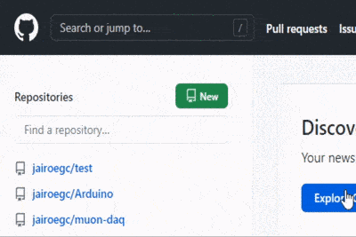
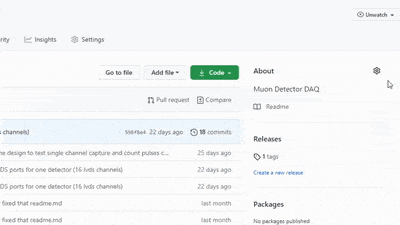
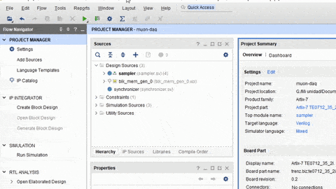
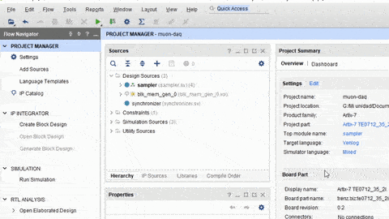

# Muon Detector Data Acquisition System

FPGA based DAQ for sTGC muon detector system, for muongraphy purposes.

Index:

1. [Prerrequisites](##Prerequisites)
2. [Vivado Project Rebuild](##Vivado-Project-Rebuild)
3. [Author](##Author)
4. [Supervising Professor](##Supervising-Professor)
5. [Apendix A: Version control of a HDL Vivado Project](##Apendix-A:-Version-control-of-a-HDL-Vivado-Project)

## Prerequisites

This project was designed on Vivado 2019.1 under Windows 10.

The FPGA used for this desing is a TRENZ TE0712-02 mounted on a TE0703-06 carrier board.

## Vivado Project Rebuild

To rebuild this project, open Vivado TCL Console, and type the following lines:

```bash
cd "path_to_main_folder_of_this_repo/"
source buidl.tcl
```

Where 'path_to_main_folder_of_this_repo' must be changed to the corresponding folder path of the project, where 'build.tcl' file is included. This file use or creates a folder named 'wd' (working directory) where all vivado outputs will be generated an saved. Ensure to not commit this folder o its containing files to this repository.

## Author

- **Jairo González** -  jairo.gonzalez.13 [at] sansano.usm.cl

## Supervising Professor

- **Gonzalo Carvajal** - Departamento de Electrónica - Universidad Técnica Federico Santa María

----

## Apendix A: Version control of a HDL Vivado Project

A version control system, like *git*, enables the developer to maintain multiple branches, synchronize their work with others, revert changes and maintain tidy versions of a project.

Using tools like this ones with Vivado Projects turns out to be pretty useful. In this appendix I have sumarized all tips and stages to control versions of a Vivado Project in form of a tutorial. The main idea is control just the core files of the development, keeping outside any other file like synthesys outputs, .bit files, etc.

The tutorial is based on "git" and a remote repository hosted on *github.com*.

Requisites:

- A github.com account.
- git installed in your machine, enabled to be operated through a terminal.
- Vivado HDL SDK (2019.1 was used in this tutorial).

### How

- **Create repo**

  Login to a github account and click the *"New"* green button to create a new repository.

  

  Choose your repository name and configure the essentials. I recommend to initiate a blank project, without readme o gitignore files. Those ones can be uploaded remotely on a first commit.

- **Clone repo**

  From the repository dashboard, look for de green button *"Code"* and copy the URL available for HTTPS cloning.

  

  If you haven't installed *git* yet, go to your local machine and install it via command line o via a downloadable executable file.

  Go to the folder where you want to save your repository and open a command prompt. Type the following on it, where *your-git-url* is the URL you have previously copied:

  ```bash
  git clone your-git-url
  ```

- **Create initial files and folders**

  Go to the repository folder and create the following folders: *ip*, *src*, *wd*, and *xdc*.

  - *ip*: This folder is intended for including IP cores files.

  - *src*: This folder is for saving the source files of your project

  - *sim*: This folder is for saving the simulation files for testing your design

  - *xdc*: This one is intended for saving .xdc contraints files

  - *wd*: Finally, this folder is for saving the Vivado generated files, synthesis and implementations outputs, etc. This folder must not be included in commits.

  Create a README.MD and a .gitinit file. The readme file is important for explaining your repo content and may be written with Markdown language. For the .gitinit, include any system-created file to dont upload it to git, and add the following lines to dont include file and folders generated from vivado:

  ```txt
  wd/
  .Xil/
  ```

- **Prepare project**

  Create your project as usual, saving it into de "wd". If you have already created it on another folder, move it to "wd".
  
  Copy or create your src files on the "src" folder on the repo.  Do the same for simulation files, constraints files to their respective folders on the repo.

  If you use IP cores, ensure that you have enabled the option of IP Core containters. This create a IP Core out of a single *.xcix* file, which is useful to version controlling purposes. If vivado ask you to convert your IP cores to containers, click on *Ok*. Then move your single IP Cores files to the respective "ip" folder in the repo.

  

  Finally, replace the files listed on the "Source" section of Vivado with the files saved on your repository.

- **Export tcl**

  Export a Tcl file of the project from the Vivado GUI menu. Save it on your main repo directory and name it *build.tcl*. Keep in mind that you may need to do this every time you add or remove a file on the Vivado project. It is ok to not do it, but you will need to import and delete files manually once the project is rebuild.

  

- **Edit tcl**

  Edit your tcl file to rebuild the project just inside "wd" folder. To do this, search the following three commands:

  ```tcl
  # Set the reference directory for source file relative paths (by default the value is script directory path)
  set origin_dir "."
  ```
  
  ```tcl
  # Set the directory path for the original project from where this script was exported
  set orig_proj_dir "path-to-the-actual-vivado-project"

  # Create project
  create_project ${_xil_proj_name_} ./${_xil_proj_name_} -part part-of-your-fpga
  ```

  And replace them with those ones respectivelly:

  ```tcl
  # Set the reference directory for source file relative paths (by default the value is script directory path)
  set origin_dir [file dirname [info script]]
  ```

  ```tcl
  # Set the directory path for the original project from where this script was exported
  set orig_proj_dir "[file normalize "$origin_dir/wd/"]"

  # Create project
  create_project ${_xil_proj_name_} $orig_proj_dir/${_xil_proj_name_} -part part-of-your-fpga
  ```

- **Commit and push**

  At this point everything is ready to do the first commit and start controlling your project versions.
  Commit your work and push it with the following commands. Ensure you have correctly configured your ".gitignore" file before commiting! Review your folders and look also for any hidden file to ignore it explicitly.

  When you are done, just commit:

  ```bash
  git add .
  git commit -m "First commit."
  git push
  ```

   And thats all!

- **Delete older vivado project folder**
  
  Now you can freely delete your older vivado project folder, because you are able to rebuild it again running your new build.tcl script as indicated in [Vivado Project Rebuild](##Vivado-Project-Rebuild) section.

### References

1. [version-control-for-vivado-projects](http://www.fpgadeveloper.com/2014/08/version-control-for-vivado-projects.html)

2. [ug1198-vivado-revision-control-tutorial.pdf](https://www.xilinx.com/support/documentation/sw_manuals/xilinx2015_4/ug1198-vivado-revision-control-tutorial.pdf)

3. [UsingSourceControlSystemsWithTheVivadoTool](https://www.xilinx.com/support/documentation/sw_manuals/xilinx2018_2/ug892-vivado-design-flows-overview.pdf#nameddest=xUsingSourceControlSystemsWithTheVivadoTool)

----
